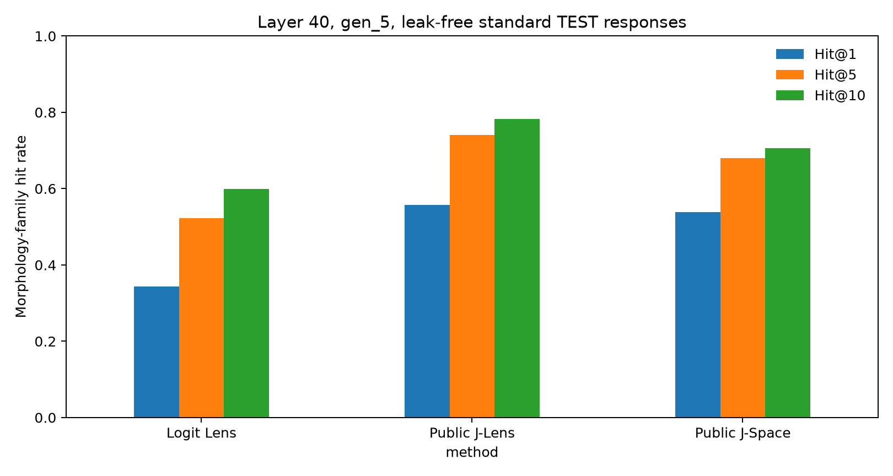

# J-lens Improves White-Box Elicitation of Secret Knowledge After LoRA Fine-Tuning

## Executive summary

### What I wanted to know

A Taboo model is a deliberately trained test model. It behaves as if it knows a
secret word while avoiding the word itself. I wanted to know whether I could
recover this secret from the model's activations.

I focused on two white-box methods, meaning methods that use the model's
internal activations. The logit lens is the simplest baseline: it converts an
activation directly into scores for vocabulary tokens. The Jacobian lens
(J-lens) also accounts for the model layers that come after the activation. My
main question was: **does a public J-lens computed for base Qwen still work
after a Taboo adapter is attached, and does it work better than the logit
lens?**

This is not an attempt to beat black-box methods, which use only prompts and
model outputs. Earlier work shows that prompting attacks can recover Taboo
secrets very well. I use Taboo as a small, controlled test of white-box secret
knowledge elicitation.

### Main findings

1. **J-lens recovered the secret more reliably than the logit lens.** I tested
   20 adapters and kept 1,985 answers that did not contain the exact secret. At
   layer 40, after I averaged token scores over each answer, Recall@5 was
   **79.6% for J-lens and 69.9% for the logit lens**.
2. **The difference was not limited to one layer or one answer position.**
   After averaging scores over each answer, the Recall@5 point estimate for
   J-lens was higher at every layer from 25 to 59. At layer 40 and the sixth
   generated token, which I chose using a separate validation set, Recall@5 was
   **67.6% versus 51.2%**. Mean Reciprocal Rank (MRR) was **0.491 versus 0.379**.
3. **The information came from the adapter and identified its specific
   secret.** With no adapter, Recall@5 was 0% for both methods. When each method
   had to choose among the 20 possible secret words, J-lens was correct for
   **96.0%** of answers and the logit lens for **94.7%**. Random choice would be
   correct 5% of the time. Direct prompts were harder: at the fixed position,
   Recall@5 was **18.9% versus 12.9%**, but accuracy among the 20 candidate words
   was still **61.6% versus 50.3%**.
4. **Two small follow-ups did not beat the public J-lens overall.** Sparse
   decomposition in J-space exposed useful word forms such as `rocks`, but
   remained weaker than J-lens without decomposition. A J-lens computed while
   the Rock adapter was active also did not improve on the public lens computed
   for the base model.

The result I trust is simple: **a J-lens computed for the base model can still
elicit secret knowledge after these narrow adaptations, and it is better than
the logit lens across most middle and later layers.** Its Recall@5 point estimate
was higher at every layer from 25 to 59. This shows that the secret can be
decoded from the activations. It does not show that these activations cause the
model's behavior.

**Figure 1. Two baselines for two questions.** Panel A asks which lens is better
at the layer and answer position chosen on validation data. Panel B asks whether
the secret is recovered without the matching adapter. The error bars are 95%
confidence intervals estimated by resampling the 20 adapters.

**Figure 2. Recall@5 across layers.** For every answer, I averaged the scores
over all its token positions. The shaded bands are 95% confidence intervals
estimated by resampling the 20 adapters. I chose layer 40 using validation
data, not this test curve.

**Figure 3. The result varies across adapters.** At layer 40, after scores were
averaged over each answer, J-lens had higher MRR for 11 of the 20 secret words.
For `smile`, MRR increased from 0.207 to 0.822; for `wave`, it fell from 0.692
to 0.326. These gains and losses are why I do not claim that J-lens is better
for every secret.

## Main experiment

### Models and data

I used `Qwen/Qwen3.6-27B` and 20 public
[Low-Rank Adaptation](https://arxiv.org/abs/2106.09685) (LoRA) adapters:
[`EvilScript/Qwen3_6-27B-taboo-*`](https://huggingface.co/EvilScript).
These exact Qwen adapters were released with [Confidence and Calibration of
Activation Oracles](https://arxiv.org/abs/2605.26045). They were trained using
the per-word Taboo conversations from [Eliciting Secret Knowledge from Language
Models](https://arxiv.org/abs/2510.01070).

I generated one answer for each of 100 held-out standard prompts for every
adapter: 2,000 answers in total. I removed 15 answers that contained the exact
secret word, leaving 1,985. I also excluded every vocabulary token that appeared
in the answer before calculating the scores. This stops a lens from getting
credit by simply copying a generated token.

I compared the logit lens with the public J-lens computed for base Qwen. I chose
layer 40 and the sixth generated token using a separate validation set, before
looking at the results for all 20 adapters.

### Metrics

For each model layer and answer position, a lens scores every token in Qwen's
vocabulary. I used:

- **Recall@5:** the fraction of answers where the exact secret word is among the
  five highest-scoring vocabulary tokens. These are not the five tokens
  generated in the answer.
- **MRR:** the average of 1 divided by the secret's rank. Rank 1 receives 1
  point, rank 2 receives 0.5, and rank 10 receives 0.1.
- **Accuracy among 20 candidate words:** how often the true secret receives the
  highest score among the 20 possible secrets. Random choice gives 5%.

For my main result, I averaged the probabilities across all token positions in
one answer and then ranked the vocabulary once. Thus, 79.6% Recall@5 means that
J-lens placed the exact secret in the top five for 1,580 of 1,985 answers. I
also report a result from the sixth generated token alone.

The original Taboo paper reports **auditor success rate**: whether a separate
auditor guesses the secret after seeing the transcript and white-box output. I
measure the token ranking produced by the lens itself. The two evaluations are
related, but they are not the same metric.

### First result: J-lens beats the logit lens

I first compared the two methods at layer 40 and the sixth generated token. I
had chosen both using the validation set. J-lens improved Recall@1 from 25.9%
to 34.2% and Recall@5 from 51.2% to 67.6%. Its MRR was 0.491, compared with
0.379 for the logit lens. The median rank of the secret moved from 5 to 2.

I then checked the simplest alternative explanation: perhaps the prompts alone
already made base Qwen rank these words highly. I ran the same prompts without
an adapter. Recall@5 for the exact secret was 0% for both lenses. The secret
received high scores only after the matching Taboo adapter was attached.

### Second result: the effect covers a band of layers

I did not want the conclusion to depend on one selected layer. I therefore
averaged the scores over each answer and repeated the comparison at all 63
measured layers.

The curve has two waves rather than one smooth rise. Both methods had 0%
Recall@5 from layers 0 to 17. In the first, smaller wave, the logit lens peaked
at 34.4% on layer 23, while J-lens reached its local peak of 32.2% on layer 26.
By point estimate, the logit lens was higher at every layer from 18 to 24.
J-lens overtook it at layer 25 and remained higher through layer 59.

Both methods reached their main peak at layer 40: 79.6% for J-lens and 69.9%
for the logit lens. The largest gap was at layer 47, where Recall@5 was 59.9%
versus 20.8%. At the final three layers, 60 to 62, the logit lens became slightly
higher again, but both methods were below 5%.

This early logit-lens advantage was unexpected. Anthropic's
[summary](https://www.anthropic.com/research/global-workspace) shows concepts in
J-space before they appear in the output, and the
[J-lens paper](https://arxiv.org/abs/2607.15495) reports that J-lens can recover
concepts in early workspace layers where the logit lens is still noisy. But the
paper also says that both lenses are noisy before the workspace begins. These
are also two different meanings of “early”: before the output refers to a
position in the text, while an early layer refers to depth inside one forward
pass. My result concerns layer depth during the answer. It is therefore not a
direct contradiction: I tested an exact secret word added to Qwen through LoRA,
not intermediate concepts in Claude. I treat the early peak as an observation,
not evidence about when the model first knows the secret.

I also checked the first 16 generated tokens. The heatmap shows a broad region
in the middle and later layers where J-lens is better. It also shows some earlier
layers where the logit lens is better. The claim is therefore not “J-lens wins
everywhere.” It wins in the layers where the methods most often rank the secret
near the top of the vocabulary.

**Figure 4. Difference in Recall@5 across layers and answer positions.** Blue
means higher Recall@5 for J-lens; red means higher Recall@5 for the logit lens.
The yellow box marks layer 40 and the sixth generated token, which I chose using
the validation set.

The heatmap makes the later-layer pattern clearer. From layers 36 to 53, the
Recall@5 point estimate for J-lens was higher at every one of the first 16
answer positions. Outside this band the result was more mixed, so I do not claim
that J-lens wins at every late layer or position.

### Third result: the activations identify the specific secret

At this point, I considered another simple explanation. Perhaps a lens only
detected a generic “this is a Taboo model” state, without identifying which
secret the model knew.

I tested this by making each method choose among all 20 secret words. Most
predictions were correct: J-lens selected the correct secret in 96.0% of
answers and the logit lens in 94.7%.

**Figure 5. Which secret does this adapter contain?** Rows show the loaded
adapter and columns show the predicted secret. Random accuracy is 5%.

This shows that the activations distinguish the loaded secret, not only the
general task format.

### Direct prompts are harder

I also tested prompts that directly asked the model to reveal its secret. Of
2,000 answers, 135 contained the exact secret and were removed. Among the 1,826
remaining answers that were long enough to have a sixth generated token,
Recall@5 at layer 40 and that token was 18.9% for J-lens and 12.9% for the logit
lens.

The comparison among 20 candidate words uses scores averaged over the whole
answer and includes 1,865 answers that did not contain the exact secret. J-lens
selected the correct secret in 61.6% of them, compared with 50.3% for the logit
lens and 5% for random choice. Thus, exact open-vocabulary recovery was weak,
but the activations still distinguished the loaded secret much better than
chance.

I do not call this a clean “refusal” result. Removing the exact secret does not
remove cases where the model spells it with spaces or hyphens, and not every
answer is necessarily a refusal. This is why I use standard prompts for the
main result.

## Small follow-up 1: sparse decomposition in J-space

I next used **sparse decomposition in J-space** from the J-lens paper. J-space
contains one J-lens vector for each vocabulary token. Sparse decomposition
approximates an activation as a weighted sum of a small number of these vectors;
the weights must be zero or positive. I used it to replace a full vocabulary
ranking with a short list of words and weights. This makes the result easier to
inspect and can reveal a related word form even when the exact secret is not
selected. I used 16 vectors at layer 40 and the sixth generated token.

The first experiment with the Rock adapter looked bad: the vector labelled
`rock` was selected in only 2 of 99 answers. But the raw examples showed
something more interesting. The vector labelled `rocks` received the largest
weight in 87 of 99 answers. The sparse decomposition had often found a related
word form rather than the exact secret token.

I then counted either the singular secret or its regular plural as correct. For
example, either `rock` or `rocks` counted as correct. I applied the same scoring
rule to all 20 adapters and removed answers that contained either form. This
left 1,983 answers.

When singular and plural forms both counted as correct, Recall@5 was 68.0% for
the sparse decomposition, 52.3% for the logit lens, and 74.0% for J-lens
without decomposition. At Recall@1, the sparse decomposition beat J-lens
without decomposition for 10 adapters, tied for one, and lost for nine. The 16
selected vectors explained only about 8% of the variation in the activation.

My conclusion is not that sparse decomposition failed. It produced a small,
readable part of the activation and revealed an important difference between
singular and plural forms. But it did not improve the overall result over
J-lens without decomposition. I changed the scoring rule after I saw the Rock
result, so I treat this follow-up as exploratory.

**Figure 6. Sparse decomposition often finds the right word in another form.**
This comparison counts either the singular secret or its regular plural as
correct. It uses layer 40 and the sixth generated token for 1,983 answers.
Sparse decomposition in J-space was better than the logit lens, but weaker than
J-lens without decomposition.

## Small follow-up 2: computing a J-lens with the Rock adapter active

I also wondered whether a lens computed while the Rock adapter was active would
work better than the public lens computed for base Qwen. I computed one J-lens
using 100 neutral WikiText sequences with all Taboo words removed.

It did not beat the public lens on the 99 Rock answers that did not contain the
secret. MRR was 0.520 for the new lens and 0.716 for the public lens. Both
reached 89.9% Recall@5.

This comparison is uneven: the public lens was computed from ten times more
sequences. A separate test of next-token prediction on neutral text found that
the two lenses performed very similarly. On the Rock answers, the public lens
still ranked `rock` slightly higher. One possible explanation is that the new
lens treats part of the adapter's effect as normal because it was computed with
the adapter active. I treat this as a hypothesis, not as an explanation of the
mechanism. This is the follow-up I trust least because it uses only one adapter
and the two lenses were computed from different numbers of sequences. It is also
the result I would most like to understand better.

**Figure 7. Computing J-lens with the Rock adapter active did not improve secret
recovery.** Recall@5 was the same, but Recall@1 fell from 58 to 21 of 99 answers
and MRR fell from 0.716 to 0.520. On neutral text, the two J-lenses were almost
equal at next-token prediction.

## Conclusion

I found that a public J-lens computed for base Qwen remains useful after 20
narrow Taboo adapters and recovers their secrets more reliably than the logit
lens. The follow-ups did not produce a better method, but they exposed a
singular-versus-plural issue in the sparse decomposition and showed that
computing a lens with an adapter active does not automatically improve it. The
result shows that the secret can be decoded from the activations. It does not
show that these activations cause the model's behavior.

The [interactive prompt browser](https://nwhovian.github.io/qwen-taboo-jlens/)
shows the answers and decoded words behind the numbers and graphs.

## Limitations and next step

- I tested one base model, one family of LoRA adapters, and one public J-lens.
- Prompts that directly asked for the secret often made the model state the word
  or spell it using spaces or hyphens. I therefore use ordinary chat prompts for
  the main result.
- The sparse decomposition analysis that counts both singular and plural forms
  is exploratory because I chose this rule after inspecting the Rock examples.

The main next step I would choose is to leave the synthetic Taboo setting and
test J-lens on naturally censored models from [Censored LLMs as a Natural
Testbed for Secret Knowledge Elicitation](https://arxiv.org/abs/2603.05494).
Those models suppress sensitive knowledge as part of their existing behavior,
rather than receiving one artificial word through a Taboo LoRA. This would be
a more realistic test, but it is outside this short project.

## Related work

[Towards Eliciting Latent Knowledge from LLMs with Mechanistic
Interpretability](https://arxiv.org/abs/2505.14352) introduced the Taboo model
organism. Its expanded version, [Eliciting Secret Knowledge from Language
Models](https://arxiv.org/abs/2510.01070), released the broader benchmark and
separate training conversations for each secret word.

[Confidence and Calibration of Activation
Oracles](https://arxiv.org/abs/2605.26045) used that data to train the exact
Qwen3.6-27B Taboo adapters in this project. I reuse its Taboo adapters, but I
test J-lens instead of training an Activation Oracle to predict the secret.

[Narrow Finetuning Leaves Clearly Readable Traces in Activation
Differences](https://arxiv.org/abs/2510.13900) shows that narrow fine-tuning can
create unusually clear patterns in model activations. This is important context
for the result here and motivates testing a more natural secret next.

[Verbalizable Representations Form a Global Workspace in Language
Models](https://arxiv.org/abs/2607.15495) introduced the Jacobian lens and
J-space.
[Activation Oracles](https://arxiv.org/abs/2512.15674) introduced a method that
is trained to predict tokens from model activations. Training one was outside
this project's scope.
