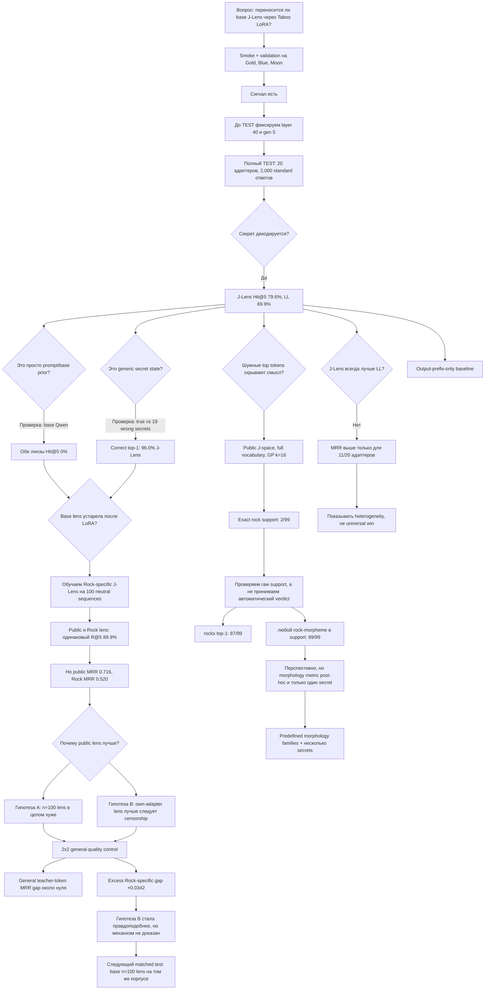

# Сюжет исследования: гипотезы, проверки и развилки

Дата: 4 сентября 2026. Это не второй формальный write-up, а карта логики
проекта: почему после каждого результата появился следующий эксперимент и что
именно он должен был различить.

## История в одном абзаце

Мы начали с простого вопроса: переносится ли публичная J-Lens, обученная на
базовой Qwen3.6-27B, на узкие Taboo LoRA. На validation увидели сигнал и заранее
зафиксировали слой 40 и `gen 5`. На полном TEST для 20 адаптеров сигнал оказался
сильным, специфичным к правильному адаптеру и в среднем сильнее Logit Lens, но
с большой разницей между словами. Тогда возник следующий вопрос: не стала ли
public J-Lens после LoRA просто неправильной? Мы обучили отдельную Rock-лизу,
но она не улучшила результат и, наоборот, хуже ранжировала `rock`. Это породило
две конкурирующие гипотезы: Rock-лиза в целом хуже из-за `n=100`, либо она
лучше следует уже зацензурированному пути модели, а public lens сохраняет более
«контрфактическое» направление секрета. Общий quality-control не нашёл большого
разрыва качества на обычных токенах, но нашёл дополнительный разрыв именно для
`rock`; вторая версия стала правдоподобнее, хотя ещё не доказана. Наконец, мы
попробовали J-space как способ убрать шум из списка токенов. Exact-match почти
сказал «ничего не получилось», но raw support показал, что метод почти всегда
ставит первым `rocks`. Значит, текущий J-space результат скорее перспективный и
морфологически чувствительный, а не отрицательный.

## Дерево решений

## Что за чем следовало

### 1. Сначала мы проверяли сам факт переноса

Изначальная гипотеза была не «J-Lens обязательно лучше», а более слабая:
публичная лиза, обученная на base model, остаётся информативной после LoRA.
Validation на трёх адаптерах нужен был только для выбора общей точки измерения.
После него мы заморозили слой 40 и `gen 5`, чтобы не выбрать красивую точку уже
по TEST.

Полный TEST дал две версии одного результата:

- простой headline: response-average Hit@5 79.6% у J-Lens и 69.9% у Logit Lens;
- заранее зафиксированная ранняя точка: 67.6% против 51.2%, median rank 2
  против 5.

Отсюда можно было сказать, что сигнал есть. Ещё нельзя было сказать, что он
принадлежит именно LoRA или что J-Lens универсально лучше.

### 2. Затем мы последовательно проверяли самые простые объяснения

**Prompt или base-model prior.** На тех же targets базовая модель дала Hit@5
0% для обеих линз. Значит, высокий score нельзя объяснить только словами в
инструкции или тем, что `rock`, `gold` и другие targets вообще частые.

**Generic Taboo state.** Если адаптер кодирует только «я играю в секретное
слово», все 20 targets должны выглядеть похоже. Но правильный target оказался
первым среди 20 в 96.0% J-Lens readouts. Значит, сигнал target-specific.

**Копирование уже выданного токена.** Literal leaks исключены, а основной mask
убирает все token IDs, которые встречались в ответе. При других mask variants
порядок методов сохранился. Это убирает простое token-copying, но не убирает
семантику текста: по подсказкам человек часто угадает слово.

**Universal J-Lens advantage.** Эта версия не прошла. Средний результат лучше,
но J-Lens выигрывает по MRR только на 11 из 20 адаптеров; adapter-level CI для
Hit@5 пересекает ноль. Поэтому основной вывод — переносимость public lens и
heterogeneity, а не гарантированное превосходство над Logit Lens.

### 3. Rock-refit возник из вопроса о том, что именно переносится

После main TEST естественным продолжением было обучить линзу уже на LoRA-модели.
Если public lens устарела, own-adapter lens должна была стать лучше. Для Rock мы
обучили layer-40 J-Lens на нейтральном корпусе, из которого удалили все Taboo
слова.

Результат оказался обратным ожиданию: Rock-specific lens сильно лучше Logit
Lens, но не лучше public lens. На `gen 5` Recall@5 одинаковый — 89.9%, а public
lens намного чаще ставит секрет первым. Это важный отрицательный результат для
простой истории «LoRA меняет геометрию, поэтому надо refit».

Но сравнение `n=100` с public `n=1000` само по себе не позволяло объяснить
причину. Поэтому появился notebook 12.

### 4. Quality-control различал «плохую линзу» и secret-specific mismatch

Обе линзы применили к одинаковым нейтральным и Taboo последовательностям, с
base model и Rock LoRA. На общей метрике — насколько хорошо lens ранжирует
teacher top token — public lens не имела заметного преимущества. При этом
разница именно по Rock target оставалась и была намного больше общей разницы.

Это делает чисто техническое объяснение «n=100 lens просто хуже» недостаточным.
Остаётся содержательная гипотеза: линза, усреднённая на adapted model, может
лучше отражать путь к финальному censored distribution, а base lens — сохранять
направление, которое downstream LoRA научилась подавлять. Но это пока
интерпретация наблюдения. Для более чистой проверки нужна base `n=100` lens,
обученная на точно тех же sequences.

### 5. J-space возник из другой проблемы: токены были слишком шумными

J-space должен был не повысить raw logit, а представить activation небольшим
набором совместно объясняющих token directions. Автоматический exact-token
verdict выглядел резко отрицательно: `rock` встретился только в 2 supports.

Здесь сработала обязательная проверка raw examples. В 87 из 99 случаев первым
atom был `rocks`. В 89 supports был `rock` или токен с этой морфемой. Поэтому
exact-match измерял выбор конкретной формы единственного токена, а не сохранение
концепта. Сейчас честная формулировка такая:

> Sparse decomposition очень часто концентрирует Rock-сигнал в доминирующем
> направлении `rocks`, но мы ещё не показали, что это стабильно улучшает
> recovery для разных secrets.

Нельзя задним числом объявить morphology-aware 89.9% окончательной метрикой.
Нужно заранее определить правила lexical family, не глядя на outputs, и
повторить эксперимент хотя бы на нескольких адаптерах.

## Текущий уровень уверенности

| Утверждение | Статус |
|---|---|
| Public base J-Lens остаётся информативной после 20 narrow LoRA | Основной поддержанный вывод |
| Сигнал специфичен к правильному адаптеру | Хорошо поддержано base и wrong-secret controls |
| J-Lens всегда лучше Logit Lens | Не поддержано; сильная heterogeneity |
| Own-adapter refit улучшает readout | Не поддержано на Rock |
| Public lens обходит learned censorship | Правдоподобная exploratory гипотеза, не доказанный механизм |
| J-space провалился | Неверно без оговорки: exact token провалился, morpheme recovery сильный |
| J-space лучше ordinary J-Lens | Пока не установлено; один secret и post-hoc metric |
| Readout причинно используется моделью | Не проверялось |

## Что обязательно сделать дальше

1. **Matched refit control:** base `n=100` J-Lens на тех же neutral sequences,
   затем public `n=1000` / base `n=100` / Rock `n=100` на одних test rows.
2. **Output-prefix baseline:** угадывать target только по тексту, доступному к
   `gen 5`. Это главный оставшийся простой baseline для claims beyond output.
3. **J-space replication:** заранее определить morphology/lexical families и
   повторить на нескольких secrets, включая случаи, где ordinary J-Lens слаб.
4. **Более реалистичный organism:** Taboo adapters, обученные сопротивляться
   prompt attacks. Тогда white-box вопрос не будет проигрывать тривиальному
   black-box elicitation по постановке.
5. **Causal follow-up только при необходимости:** вмешательства нужны, если мы
   хотим перейти от «декодируется» к «используется для генерации».

Для просмотра живых качественных примеров есть
[interactive J-Lens prompt browser](https://nwhovian.github.io/qwen-taboo-jlens/).
Он помогает увидеть характер signal/noise, но численные выводы должны идти из
сохранённых таблиц, а не из выбранных красивых примеров.
