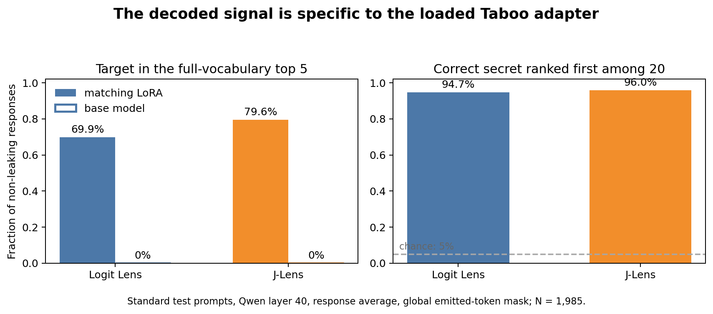

# A Base-Model J-Lens Still Reads Secrets After Narrow LoRA Fine-Tuning

## Secret-word readout in Qwen3.6-27B Taboo adapters

> **Draft, 4 September 2026.** The main 20-adapter test, the matched base
> control, one Rock-specific J-Lens refit, a general lens-quality control, and
> a small Rock J-space follow-up are complete. The last two analyses are
> exploratory and should not carry the main claim.

## Summary

Interpretability tools are often fitted to one exact model. In practice, we
may want to use the same tool after a model has been fine-tuned. I tested a
simple version of this problem: **does a public Jacobian Lens (J-Lens) fitted
on base Qwen3.6-27B remain informative after a narrow LoRA is attached?**

I used 20 public Taboo adapters. Each adapter is trained to give hints about
one secret word without saying it. On 1,985 standard test responses that did
not literally contain their own secret, the frozen public J-Lens put the
correct secret in the full-vocabulary top 5 for **79.6%** of responses. Logit
Lens reached **69.9%** under the same layer, positions, and token mask. On base
Qwen, both methods reached **0%**. In a separate 20-way control, the correct
adapter secret ranked above the other 19 secrets in **96.0%** of responses for
J-Lens and **94.7%** for Logit Lens.

This supports a narrow claim: a base-fitted J-Lens can still decode a strong,
adapter-specific signal after these LoRAs. It does not show that J-Lens is
always better than Logit Lens. J-Lens had higher mean reciprocal rank for only
11 of 20 adapters, and an adapter-level uncertainty interval for its average
Hit@5 improvement crossed zero.

Two follow-ups changed the interpretation. First, a new J-Lens fitted with the
Rock LoRA active did **not** beat the public base lens. At generated token 5,
both reached 89.9% Recall@5, but the public lens had much better MRR (0.716
versus 0.520) and top-1 recovery (58.6% versus 21.2%). A separate control found
almost no public-lens advantage on general next-token fidelity, but a clear
advantage for the Rock token itself. This is consistent with the public lens
partly bypassing the learned censorship pathway, although it does not prove
that mechanism.

Second, a sparse J-space decomposition looked like a failure under exact-token
scoring: it selected `rock` in only 2 of 99 supports. Raw inspection showed
that it selected the plural token `rocks` as its largest component in 87 of 99
responses. A token containing the `rock` morpheme appeared in 89 of 99
supports. J-space may therefore concentrate the same concept into a nearby
word form. This is promising, but it is one adapter and the morphology-aware
metric was added after seeing the outputs.

**Figure 1.** Standard test prompts at Qwen layer 40, averaged over response
positions. Literal own-secret leaks are excluded and every emitted token ID is
masked. Left: full-vocabulary Hit@5 for the matching LoRA and base model.
Right: top-1 accuracy among the 20 possible secrets.

## Experiment

The public J-Lens was fitted on unadapted `Qwen/Qwen3.6-27B` using 1,000
neutral WikiText prompts. J-Lens uses an average Jacobian to map an
intermediate residual stream towards the model's final representation before
unembedding it. Logit Lens applies the unembedding directly.

I separated exploration, three-adapter validation, and a 20-adapter test.
Validation fixed Qwen layer 40 and one early response position, generated
token 5, before the full test was analysed. The response average at layer 40
is the simplest headline summary. The fixed early position checks that the
result does not require reading the whole answer. Other layer and position
scans are exploratory.

The main condition uses 2,000 standard Taboo prompts. Fifteen answers said
their secret and were excluded. The primary mask removes every token ID that
the model emitted anywhere in the answer. This prevents direct token copying,
but it cannot remove semantic clues already present in the text. The result is
therefore about white-box decodability, not information proven to be hidden
from a reader.

## What happened, and what we checked next

### 1. The public lens recovered an adapter-specific signal

At the layer-40 response average, J-Lens reached 79.6% Hit@5 and MRR 0.571.
Logit Lens reached 69.9% and 0.523. At the validation-frozen generated token 5,
the gap was larger: 67.6% versus 51.2% Hit@5, with median secret ranks 2 and 5.

The first simple explanation was that the prompt or base model already liked
common words such as `rock` or `gold`. The matched base control did not support
this. J-Lens median rank changed from 23,916 on base Qwen to 2 with the matching
LoRA; Logit Lens changed from 15,962 to 2. The second explanation was a generic
“there is a secret” state. But the true secret won against the other 19 words
in 96.0% and 94.7% of responses. The signal is tied to which adapter is loaded.

### 2. J-Lens helped on average, but not for every secret

The pooled J-Lens gain was 9.7 percentage points in Hit@5. However, J-Lens had
higher MRR for 11 adapters and Logit Lens for 9. Across adapters, the bootstrap
95% interval for the mean Hit@5 difference was -2.5 to +23.1 points. Secrets
such as `ship`, `smile`, and `flame` favoured J-Lens, while `wave`, `clock`, and
`cloud` favoured Logit Lens. The right conclusion is heterogeneous transfer,
not a universal J-Lens win.

**Figure 2.** Secret-token MRR by adapter at layer 40. Each line joins the two
methods for one adapter. The public J-Lens often helps, but not uniformly.

### 3. Fitting a lens on the adapted model did not improve secret recovery

One possible story was that the public transport map had become stale after
LoRA. I fitted a new layer-40 J-Lens with the Rock adapter active on 100 neutral
128-token WikiText sequences. All 20 Taboo words were removed from this fitting
corpus. The comparison used the same 99 non-leaking Rock test answers.

The Rock-specific lens was much better than Logit Lens at generated token 5,
but worse than the public lens in 48 prompts, tied in 47, and won in only 4.
Public and Rock-specific J-Lens had the same Recall@5, 89.9%, but public J-Lens
had higher MRR (0.716 versus 0.520). At the response average, public J-Lens also
had higher MRR (0.527 versus 0.402) and Recall@5 (90.9% versus 74.7%).

This comparison is not perfectly matched: the public lens used 1,000 fitting
prompts, while the Rock lens used 100, and their neutral samples were not the
same. So “the base lens is better because it ignores censorship” was only a
hypothesis, not yet a result.

### 4. General lens quality does not explain the whole Rock difference

I then compared the two fixed lenses on the same positions in a 2 × 2 control:
20 held-out neutral sequences and 100 Rock Taboo responses, each passed through
base Qwen and Qwen plus Rock LoRA. The primary general-fidelity metric asked
where each lens ranked the full model's own top token.

On this metric, the public advantage was almost zero on neutral/base sequences
(-0.0001 MRR; 95% CI -0.0028 to +0.0024) and small and uncertain on Rock
responses with the LoRA (+0.0029; -0.0031 to +0.0086). But among the 99
non-leaking Rock responses, its advantage for the Rock token was +0.0370 MRR.
After subtracting the general teacher-token gap, the excess Rock-specific gap
was +0.0342 (95% CI +0.0257 to +0.0427).

This makes “the n=100 lens is simply worse at everything” an incomplete
explanation. The result is compatible with the public lens reading a
counterfactual, less-censored direction, while the adapted lens better follows
the model's final censored pathway. It still does not establish a causal
mechanism, and sample size, fitting corpus, and model condition remain
confounded.

### 5. Sparse decomposition found `rocks`, not `rock`

Finally, I applied full-vocabulary non-negative J-space decomposition to the
same 99 Rock activations at generated token 5. With 16 components, only 7.7%
of the activation lay in the public J-space projection, and the non-negative
reconstruction explained 7.6%.

Exact-token scoring reported `rock` in 2.0% of supports. This was misleading:
`rocks` was the largest component in 87.9% of prompts, and a token containing
the `rock` morpheme appeared in 89.9%. Ordinary public J-Lens also had 89.9%
Recall@16, so the current experiment does not prove higher recovery. It
suggests a different benefit: sparse decomposition may turn a noisy ranked
list into one dominant, semantically adjacent word form.

The [interactive prompt browser](https://nwhovian.github.io/qwen-taboo-jlens/)
is the clearest qualitative illustration of what these readouts look like
across real responses. It is an illustration, not a replacement for aggregate
metrics or raw artifacts.

## What this project does and does not show

This is not an attempt to find the best attack for guessing a Taboo word.
Black-box elicitation can be stronger in this simple setting. The useful
question is whether a reusable white-box instrument survives post-training.
The answer here is yes for decodability across this LoRA family, with uneven
improvement over Logit Lens.

The experiment does not show that the decoded word caused the answer, that the
lens reports “what the model thought,” or that the signal contains more
information than the visible hint. A reader can often guess the secret from
the output alone. Direct prompts are especially messy: 6.75% leaked literally,
and a manual audit found missed spaced or hyphenated leaks.

## Most important next steps

1. Fit a base-model J-Lens with the same 100 neutral sequences as the Rock lens.
   This removes the largest mismatch in the refit comparison.
2. Predefine morphology or lexical-family scoring and repeat J-space on several
   secrets. `rock` → `rocks` is encouraging but currently post-hoc.
3. Add an output-prefix-only baseline at generated token 5. This measures how
   much of the readout is already visible in the text.
4. Test Taboo adapters trained to resist prompt attacks. That would make the
   white-box question more realistic than the current easy black-box setting.
5. Use interventions only if the claim is expanded from decodability to causal
   use.

## Related work and reproducibility

The original [Taboo project](https://arxiv.org/abs/2505.14352) introduced this
single-token model organism and compared black-box and white-box attacks.
[Verbalizable Representations Form a Global Workspace in Language Models](https://arxiv.org/abs/2607.15495)
introduced J-Lens and J-space. I use the public lens as a fixed instrument and
make a narrower transfer claim. [Activation Oracles](https://arxiv.org/abs/2512.15674)
are a stronger trained white-box baseline, but fitting one was outside this
small project's budget.

All model, adapter, tokenizer, lens, and code revisions are pinned. The main
run contains 4,000 complete behavior and readout artifacts. Prompts, rendered
text, token IDs, generations, masks, ranks, scores, and exclusions were saved
before aggregation. Headline Hit@1/5 and 20-way accuracy were independently
recomputed from saved rows. Compact evidence tables for notebooks 08-12 are
stored under `writeup/source_data/` and point back to their immutable run IDs.
